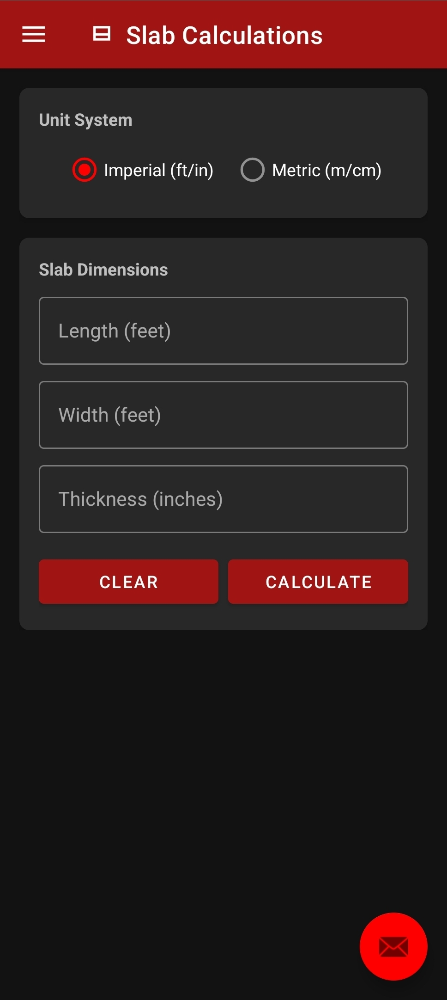
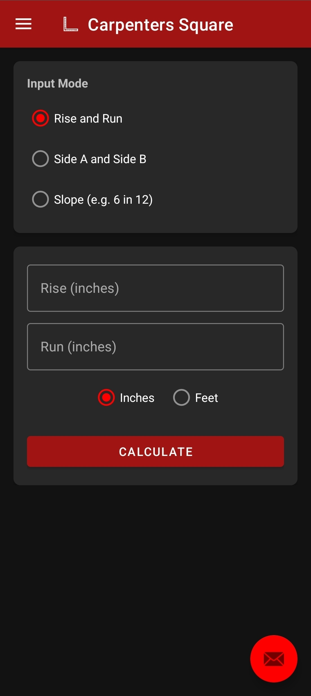
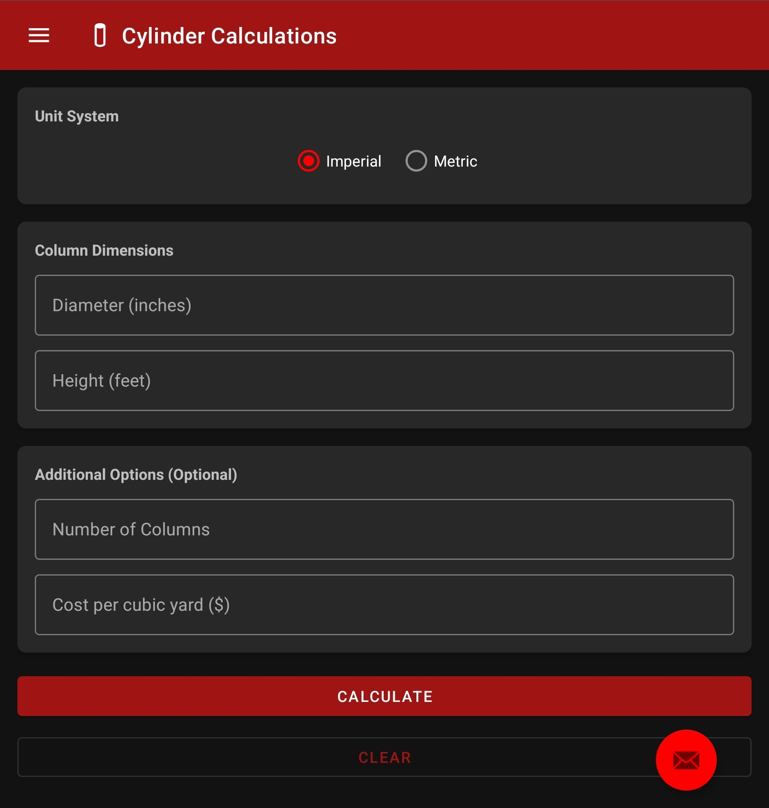
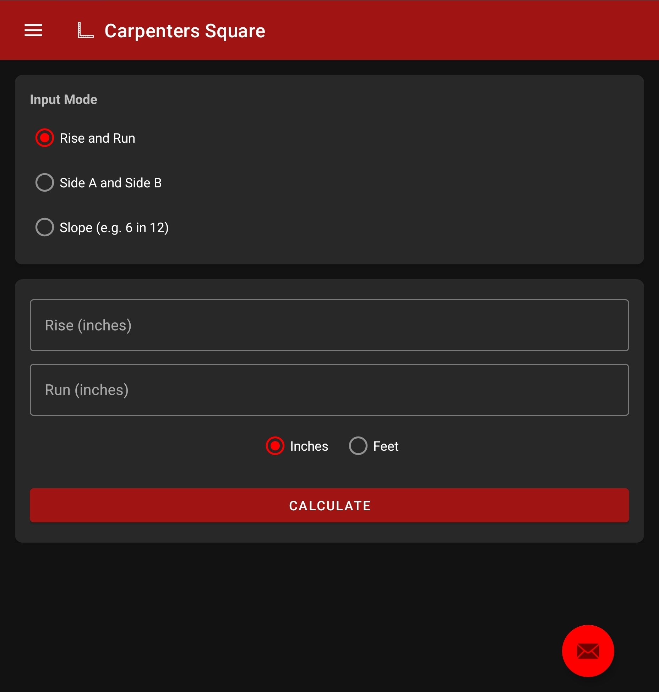

# 🛠️ TriTools

**TriTools** is a modern construction calculation app designed for field professionals, engineers, and contractors. Calculate faster and work smarter with streamlined concrete and carpentry tools – all in your pocket.

## 📱 **What is TriTools?**

TriTools provides:

✅ Concrete volume calculators (slabs, footings, walls, steps, curbs, columns)  
✅ Carpentry measurement tools  
✅ Simple, intuitive interface  
✅ Offline functionality – no internet required in the field

## 🚀 **Why Use TriTools?**

- **Accurate calculations** reduce costly material waste.  
- **Fast UI** for use in high-pressure fieldwork.  
- **Expandable categories** for specialized trade workflows.

## 🔒 **Privacy & Security**

We value your privacy.

🔗 [Read our Privacy Policy](https://github.com/Gr8-Dayne/Tri_Power/blob/main/PRIVACY.md)

## 📸 **Screenshots**

### 2376 x 968 Screen
| Concrete Calculators | Carpentry Tools |
| --- | --- |
|  |  |

### 2160 x 1856 Screen
| Concrete Calculators | Carpentry Tools |
| --- | --- |
|  |  |

---

## 🏗️ **Upcoming Features**

- Rebar calculators  
- Advanced concrete mix estimates  
- Unit conversions  
- Dark mode customization
- Login system
- Saved calculations

## ✉️ **Contact & Support**

For support, feature requests, or business inquiries:

📧 **info@tripower.com**

## ⭐ **About TriPower**

TriTools is developed by **Tri Power Technologies** to empower professionals with digital tools that keep projects moving efficiently.

> **Built for the field. Designed for precision.**
